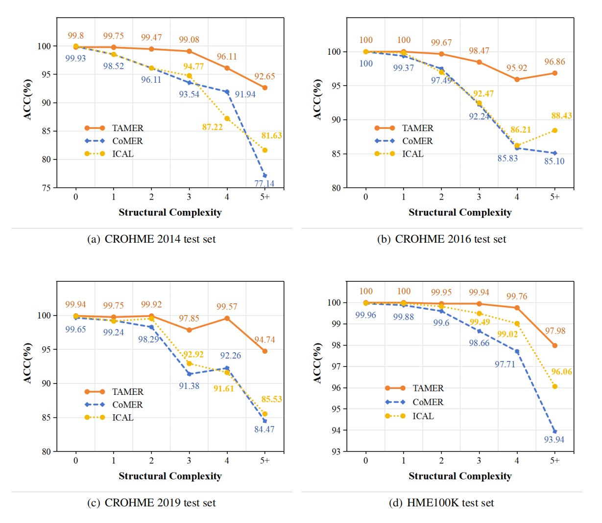

<div align="center">    
 
# TAMER: Tree-Aware Transformer for Handwritten Mathematical Expression Recognition
[](https://arxiv.org/abs/2408.08578)

</div>

## News
[2024/12/10] TAMER has been accepted to AAAI 2025! 🎉🎉🎉

## Project structure
```bash
├── config/         # config for TAMER hyperparameter
├── data/
│   └── crohme      # CROHME Dataset
│   └── HME100k      # HME100k Dataset which needs to be downloaded according to the instructions below.
├── eval/             # evaluation scripts
├── tamer               # model definition folder
├── lightning_logs      # training logs
│   └── version_0      # ckpt(w/o fusion) for CROHME dataset 
│       ├── checkpoints
│       │   └── epoch=315-step=118815-val_ExpRate=0.6113.ckpt
│       ├── config.yaml
│       └── hparams.yaml
│   └── version_1      # ckpt(w/o fusion) for HME100K dataset 
│       ├── checkpoints
│       │   └── epoch=51-step=162967-val_ExpRate=0.6851.ckpt
│       ├── config.yaml
│       └── hparams.yaml
│   └── version_2      # ckpt(w/ fusion) for CROHME dataset 
│       ├── checkpoints
│       │   └── 
│       ├── config.yaml
│       └── hparams.yaml
│   └── version_3      # ckpt(w/ fusion) for HME100K dataset 
│       ├── checkpoints
│       │   └── epoch=55-step=175503-val_ExpRate=0.6954.ckpt
│       ├── config.yaml
│       └── hparams.yaml
├── .gitignore
├── README.md
├── requirements.txt
├── setup.py
└── train.py
```

## Install dependencies   
```bash
cd TAMER
# install project   
conda create -y -n TAMER python=3.7
conda activate TAMER
conda install pytorch=1.8.1 torchvision=0.2.2 cudatoolkit=11.1 pillow=8.4.0 -c pytorch -c nvidia
# training dependency
conda install pytorch-lightning=1.4.9 torchmetrics=0.6.0 -c conda-forge
# evaluating dependency
conda install pandoc=1.19.2.1 -c conda-forge
pip install -e .
 ```
## Dataset Preparation
We have prepared the CROHME dataset and HME100K dataset in [download link](https://disk.pku.edu.cn/link/AAF10CCC4D539543F68847A9010C607139). After downloading, please extract it to the `data/` folder.

## Training on CROHME Dataset
Next, navigate to TAMER folder and run `train.py`. It may take **8~9** hours on **4** NVIDIA 2080Ti gpus using ddp.
```bash
# train TAMER model using 4 gpus and ddp on CROHME dataset
python -u train.py --config config/crohme.yaml
```

For single gpu user, you may change the `config.yaml` file to
```yaml
gpus: 1
```

## Training on HME100k Dataset
It may take about **48** hours on **4** NVIDIA 2080Ti gpus using ddp on HME100k dataset.
```bash
# train TAMER model using 4 gpus and ddp on hme100k dataset
python -u train.py --config config/hme100k.yaml
```

## Evaluation
Trained TAMER weight checkpoints for CROHME and HME100K Datasets have been saved in `lightning_logs/version_0` and `lightning_logs/version_1`, respectively.

```bash
# For CROHME Dataset
bash eval/eval_crohme.sh 0

# For HME100K Dataset
bash eval/eval_hme100k.sh 1
```

## Experimental Results

### CROHME Dataset
| Method | CROHME 2014 ExpRate↑ | CROHME 2014 ≤1↑ | CROHME 2014 ≤2↑ | CROHME 2016 ExpRate↑ | CROHME 2016 ≤1↑ | CROHME 2016 ≤2↑ | CROHME 2019 ExpRate↑ | CROHME 2019 ≤1↑ | CROHME 2019 ≤2↑ |
|--------|----------------------|-----------------|-----------------|----------------------|-----------------|-----------------|----------------------|-----------------|-----------------|
| NAMER  | 60.51                | 75.03           | 82.25           | 60.24                | 73.5            | 80.21           | 61.72                | 75.31           | 82.07           |
| BTTR   | 53.96                | 66.02           | 70.28           | 52.31                | 63.90           | 68.61           | 52.96                | 65.97           | 69.14           |
| GCN    | 60.00                | -               | -               | 58.94                | -               | -               | 61.63                | -               | -               |
| CoMER† | 58.38±0.62           | 74.48±1.41      | 81.14±0.91      | 56.98±1.41           | 74.44±0.93      | 81.87±0.73      | 59.12±0.43           | 77.45±0.70      | 83.87±0.80      |
| ICAL   | 60.63±0.61           | 75.99±0.77      | 82.80±0.40      | 58.79±0.73           | 76.06±0.37      | 83.38±0.16      | 60.51±0.71           | 78.00±0.66      | 84.63±0.45      |
| **TAMER** | **61.23±0.42**    | **76.77±0.78**  | **83.25±0.52**  | **60.26±0.78**       | **76.91±0.38**  | **84.05±0.41**  | **61.97±0.54**       | **78.97±0.42**  | **85.80±0.45**  |

### HME100K Dataset

| Method | HME100K ExpRate↑ | HME100K ≤1↑ | HME100K ≤2↑ |
|--------|----------------------|-----------------|-----------------|
| BTTR   |          64.1       | -           |      -      |
| CoMER† |          68.12       | 84.20           |      89.71      |
| ICAL   |          69.06       | 85.16          |     90.61       |
| NAMER  |          68.52       | 83.10        |     89.30      |
| TAMER  |          68.52       | 84.61      |      89.94     |
| TAMER w/ fusion|          **69.50**       | **85.48**     |      **90.80**     |

### Bracket Matching Accuracy
<figure>
    
    <figcaption>Bracket Matching Accuracy under different structural complexities on CROHME 2014/2016/2019 and HME100K (in %). TAMER consistently maintains an accuracy rate of over 92% across various structural complexities, effectively resolving bracket matching issues.</figcaption>
</figure>


## Reference
- [CoMER](https://github.com/Green-Wood/CoMER) | [arXiv](https://arxiv.org/abs/2207.04410)
- [ICAL](https://github.com/qingzhenduyu/ICAL) | [arXiv](https://arxiv.org/abs/2405.09032)
- [BTTR](https://github.com/Green-Wood/BTTR) | [arXiv](https://arxiv.org/abs/2105.02412)
- [TreeDecoder](https://github.com/JianshuZhang/TreeDecoder)
- [CAN](https://github.com/LBH1024/CAN) | [arXiv](https://arxiv.org/abs/2207.11463)

